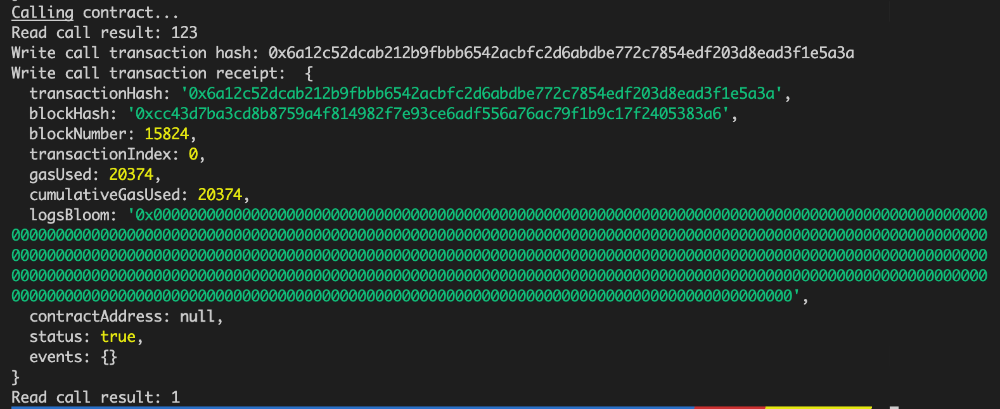

## Contract Call Screenshot


## The transaction hash from the contract deployment
0x6a12c52dcab212b9fbbb6542acbfc2d6abdbe772c7854edf203d8ead3f1e5a3a

## The contract address that you called
0x9141Bbc41F3a8374513891bfEf8e7e324EEBeb62

## The ABI for contract you made a call on
```javascript
[
    {
      "inputs": [],
      "stateMutability": "payable",
      "type": "constructor"
    },
    {
      "inputs": [
        {
          "internalType": "uint256",
          "name": "x",
          "type": "uint256"
        }
      ],
      "name": "set",
      "outputs": [],
      "stateMutability": "payable",
      "type": "function"
    },
    {
      "inputs": [],
      "name": "get",
      "outputs": [
        {
          "internalType": "uint256",
          "name": "",
          "type": "uint256"
        }
      ],
      "stateMutability": "view",
      "type": "function"
    }
  ]
```
