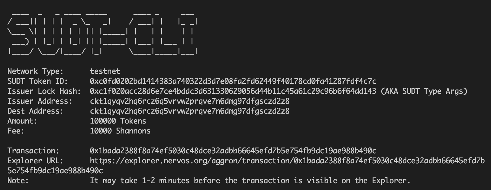
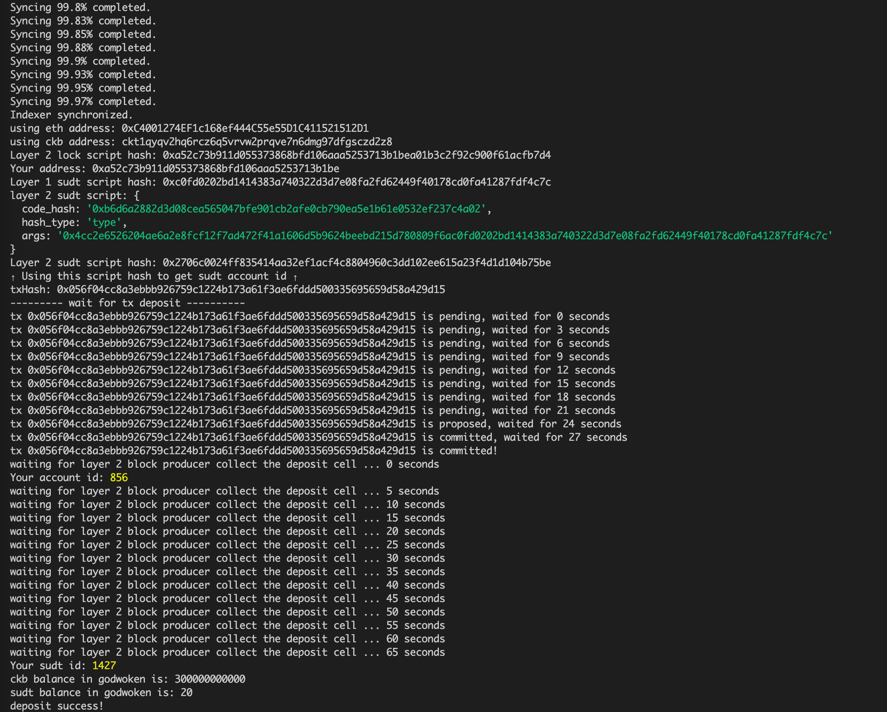

## A link to the Layer 1 address you funded on the Testnet Explore
[ckt1qyqv2hq6rcz6q5vrvw2prqve7n6dmg97dfgsczd2z8](https://explorer.nervos.org/aggron/address/ckt1qyqv2hq6rcz6q5vrvw2prqve7n6dmg97dfgsczd2z8)

## A screenshot of the console output immediately after using sudt-cli to create your SUDT tokens on Layer 1C

## A link to the transaction ID created by sudt-cli on the Testnet Explorer.
[0x1bada2388f8a74ef5030c48dce32adbb66645efd7b5e754fb9dc19ae988b490c](https://explorer.nervos.org/aggron/transaction/0x1bada2388f8a74ef5030c48dce32adbb66645efd7b5e754fb9dc19ae988b490c)

## A screenshot of the console output immediately after you have successfully submitted a deposit to Layer 2 using the account-cli tool.

## The SUDT ID from the console output after executing the deposit script

1427
