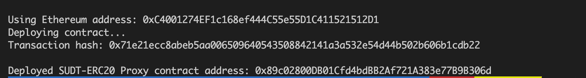
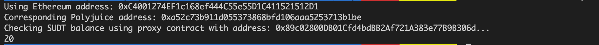

## A screenshot of the console output immediately after deploying smart contract

## The address of the ERC20 Proxy Contract you deployed (in text format)
0x89c02800DB01Cfd4bdBB2Af721A383e77B9B306d

## A screenshot of the console output immediately after checking your SUDT balance

## The Ethereum address that was checked (in text format)
0xC4001274EF1c168ef444C55e55D1C411521512D1
