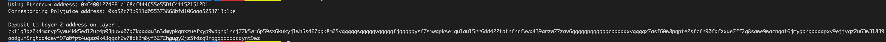

## A screenshot of the console output immediately after you have successfully generated your Deposit Receiver Address

## Your Deposit Receiver Address (in text format)
ckt1q3dz2p4mdrvp5ywu4kk5edl2uc4p03puvx07g7kgqdau3n3dmypkqnxzuefxyp9wdghglncj77k5wt6p59sx6kukyjlwh5s467qgp8m25yqqqqqsqqqqqvqqqqqfjqqqqqysf7smwgpksetqulaul5rr6dd422tatnfncfwva439arzw77zav6gqqqqpqqqqqqcqqqqqxyqqqqx7asf60w8pqpte2sfcfn90fdfzxue7ff2g8sawe9wacnqat6jmygqngqqqqpxv9ejjvgz2u63w3l839aadguh5rgtqd4devf97a0fpt4uqsz0k43qqzf6w78qk3m6yf3272hgugy2jz5fdzq9rqgqqqqqqcqynt9ez

## The Ethereum address used to generate the Deposit Receiver Address
0xC4001274EF1c168ef444C55e55D1C411521512D1

## A link to the Etherscan explorer for the successful Force Bridge transaction. This can be found on Force Bridge under History→Succeed
[0x0a3465496efa103328283e599c25590e4122efe73a6d19464c4af2c09068c584](https://rinkeby.etherscan.io/tx/0x0a3465496efa103328283e599c25590e4122efe73a6d19464c4af2c09068c584)

## A link to the Nervos explorer for the successful Force bridge transaction. This can be found on Force Bridge under History→Succeed
[0x4c2ebba6beb734f0958f926d608a07662e07500d6820c74b7ff2528a320bf65e](https://explorer.nervos.org/aggron/transaction/0x4c2ebba6beb734f0958f926d608a07662e07500d6820c74b7ff2528a320bf65e)
