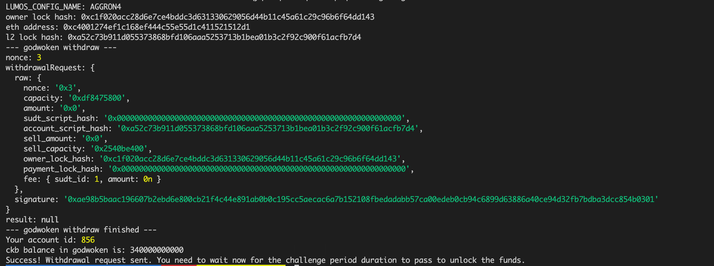

## A screenshot of the console output immediately after running the withdraw command

## The Ethereum address that you've used for your Layer 2 account
0xC4001274EF1c168ef444C55e55D1C411521512D1

## The Nervos Layer 1 address that you passed to withdraw command
ckt1qyqv2hq6rcz6q5vrvw2prqve7n6dmg97dfgsczd2z8
